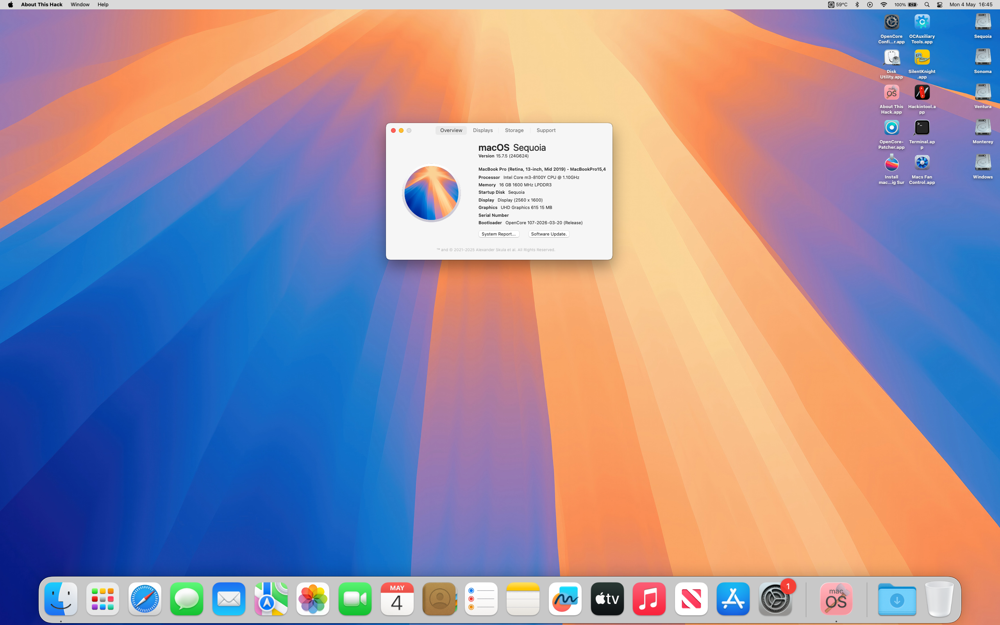
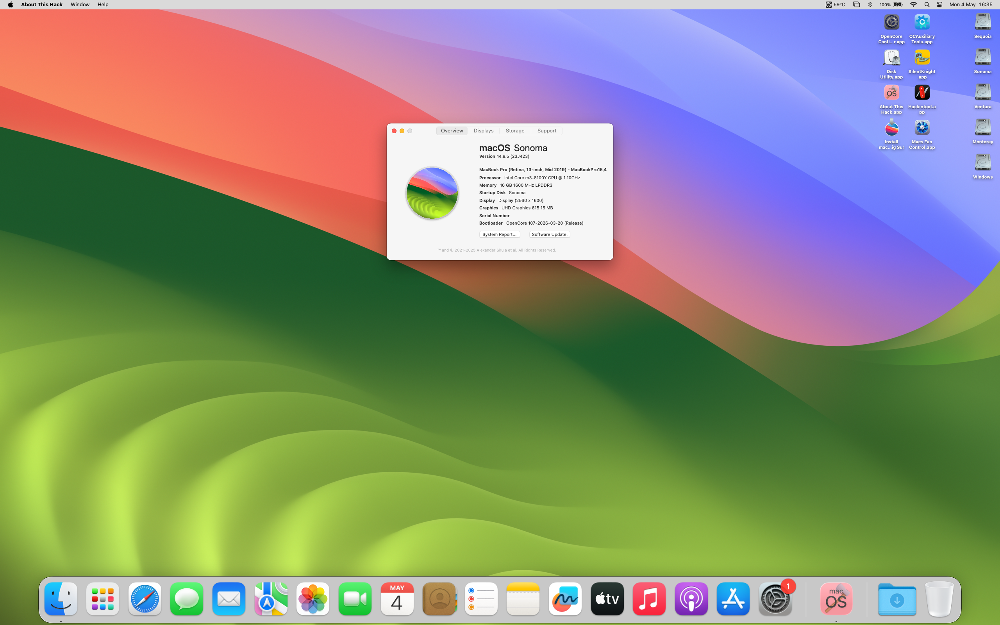
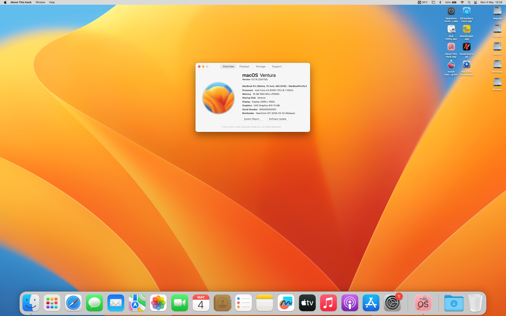
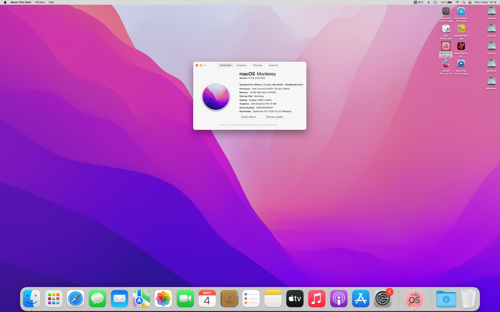
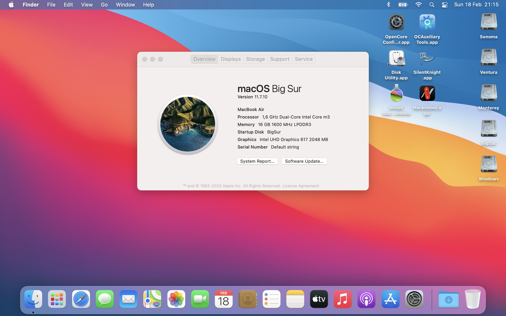
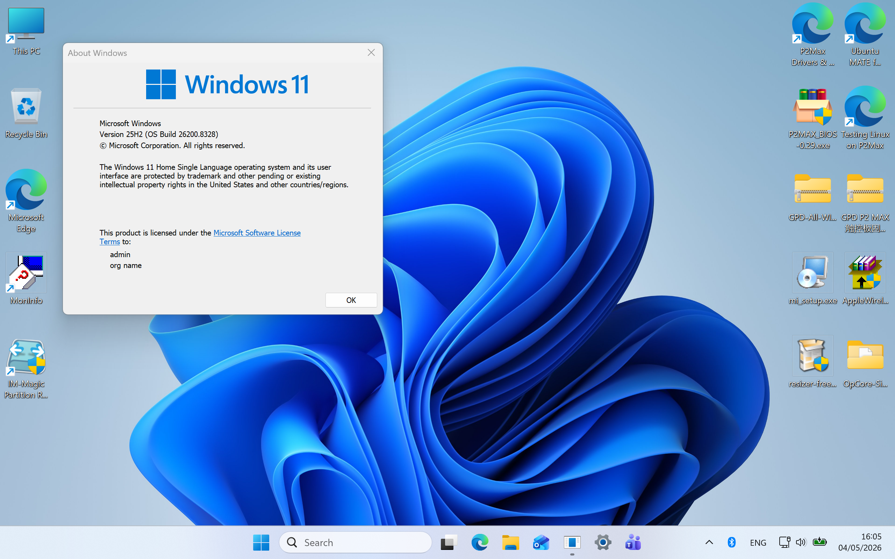
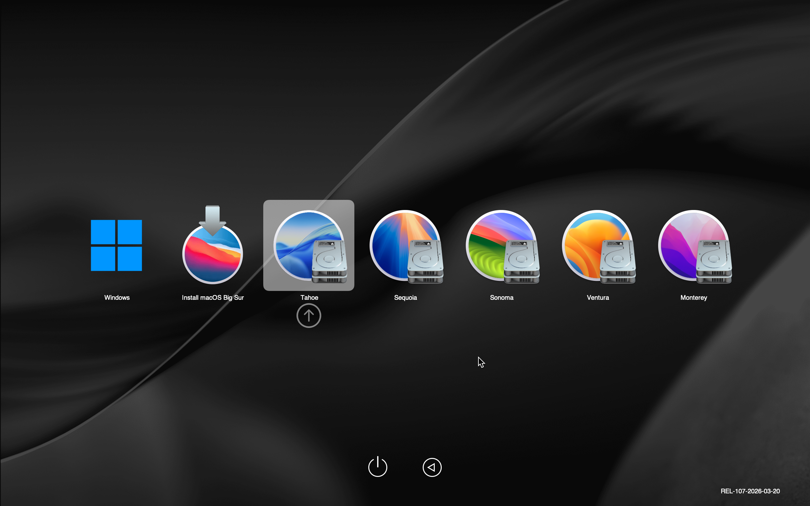

# GPD WIN Max 2020 Hackintosh [WIP]  

This EFI folder for **8" GPD WIN Max 2020** (i5-1035G7 BIOS V1.16) supports up to **macOS 26.5 Tahoe**  

With **OCAuxiliaryTools** I updated [_b00t0x/GPD-WIN-Max-Hackintosh (Jan_19, 2025)_](https://github.com/b00t0x/GPD-WIN-Max-Hackintosh) to **OpenCore 1.0.7**  
Added some Kexts and selected SMBIOS **MacBookPro16,2** (maximum OS = Tahoe)  

### _Disclaimer: This repository under construction is for testing only ._  
_I hope to inspire other enthusiasts to extensively test my EFI folder ._  
_Since I don't own a WIN Max 2020, testing it on my multiboot P2 Max 2019 yielded the following results :_  

   
   
   
    

## What’s included
........................................................... release ............ comment ....................... MinKernel .... MaxKernel  
• Lilu.kext ........................................... 1.7.2  
• VirtualSMC.kext .............................. 1.3.7  
• WhateverGreen.kext ....................... 1.7.0  
• AppleALC.kext ................................ 1.9.7  
• RestrictEvents.kext ......................... 1.1.6  
• BrightnessKeys.kext ....................... 1.0.3  
• ECEnabler.kext ................................ 1.0.6  
• FeatureUnlock.kext ......................... 1.1.8  
• HibernationFixup.kext ..................... 1.5.4  
• IntelBluetoothFirmware.kext_1_ .......... 2.4.0  
• IntelBluetoothInjector.kext_1_ ............. 2.4.0 _............... for macOS 11 or earlier ....................... 20.9.9_  
• IntelBTPatcher.kext_1_ ........................ 2.4.0  
• BlueToolFixup.kext_1_ ......................... 2.7.2 _................ for macOS 12 or later ........... 21.0.0_  
• NVMeFix.kext .................................. 1.1.3  
• RealtekRTL8111.kext ....................... 2.5.0  
• SMCBatteryManager.kext ............... 1.3.7  
• SMCProcessor.kext ......................... 1.3.7  
• SMCSuperIO.kext ............................ 1.3.7  
• USBMap.kext ................................... 1.0  
• VoodooI2C.kext ............................... 2.9.1  
• VoodooI2CGoodix.kext ................... 0.4.0  
• VoodooI2CHID.kext ......................... 1  
• VoodooPS2Controller.kext .............. 2.3.7  
• Itlwm.kext_5_ ...................................... 2.3.0_stable_ _........ for macOS 15 or later .......... 24.0.0 .... 25.9.9_  
• IOSkywalkFamily.kext_5_ .................... 1.0 _................... for macOS 15 only ............... 24.0.0 .... 24.9.9_  
• IO80211FamilyLegacy.kext_5_ ............ 1200.12.2b1 _.... for macOS 15 only ............... 24.0.0 .... 24.9.9_  
• AMFIPass.kext_5_ ............................... 1.4.1 _................ for macOS 12 or later ........... 21.0.0_  
• AirportItlwm-Sequoia.kext_5_ ............ 2.3.0_patch_ _........ for macOS 15 only ............... 24.0.0 .... 24.9.9_  
• AirportItlwm-Sonoma14.4.kext_2_ ..... 2.3.0_stable_ _........ for macOS 14.4 or later ....... 23.4.0 .... 23.9.9_  
• AirportItlwm-Sonoma14.0.kext_2_ ..... 2.3.0_stable_ _........ for macOS 14.3 or earlier .... 23.0.0 .... 23.3.9_  
• AirportItlwm-Ventura.kext_2_ ............. 2.3.0_stable_ _....... for macOS 13 only ............... 22.0.0 .... 22.9.9_  
• AirportItlwm-Monterey.kext_2_ .......... 2.3.0_stable_ _....... for macOS 12 only ................ 21.0.0 .... 21.9.9_  
• AirportItlwm-BigSur.kext_2_ ............... 2.3.0_stable_ _....... for macOS 11 only ................ 20.0.0 .... 20.9.9_  
• 360Controller.kext .......................... 1.0  

## What works  
• iGPU acceleration  
• Built-in sound  
• Keyboard  
...... Hotkeys for brightness/volume adjustment  
• Trackpad  
• Touchpanel  
• Gamepad  
...... mouse mode  
...... Pad mode ( requires _**360Controller.kext**_ )  
• Wired LAN  
• Wireless LAN  
• ThunderBolt 3 video output  
...... USB-C to DP 4K/60Hz  
...... USB-C to HDMI 4K/60Hz  
• Battery level display  
...... recommended to use _**coconutBattery.app**_ as there is approx. 5% difference in remaining battery capacity.  
• Sleep/Wake  

## What doesn't work  
• Audio output via ThunderBolt 3 port  
• HDMI video/audio output  

# Notes
### _Disclaimer: This repository under construction is for testing only._  
_The experience I learned building [_rowell1/GPD-P2-Max-2019-Hackintosh_](https://github.com/rowell1/GPD-P2-Max-2019-Hackintosh) became the reference for this project ._  

_________________________________________________________________________________________________
_1 https://openintelwireless.github.io/IntelBluetoothFirmware/FAQ.html#what-additional-steps-should-i-do-to-make-bluetooth-work-on-macos-monterey-and-newer_  
_2 https://github.com/OpenIntelWireless/itlwm/releases_  
_3 https://github.com/acidanthera/Lilu/blob/master/KnownPlugins.md_   
_4 https://osxlatitude.com/forums/topic/18095-how-do-i-grab-my-screens-edid-information/_

_**[SOLVED] Native Intel WiFi and Bluetooth on macOS Sequoia or Tahoe | Step By Step Video-Guide.**_  
_5 https://www.youtube.com/watch?v=kNXrugg25u0_  
_5 https://github.com/randomappleboi/Native-Wifi-for-Hackintoshes-with-Intel-Wireless-cards-on-macOS-sequoia_  

_**[WIP] Have to unplug/replug HDMI cable to connect to external monitor.**_  
_6 https://discussions.apple.com/thread/255088951?sortBy=rank_  

_**[ARCHIVED] GPD WIN Max Drivers & OS installation Media and BIOS V1.16**_  
_7 https://archive.org/details/gpd-win-max-drivers-and-os_  
_7 https://www.facebook.com/4GPDWin/posts/3120805251574053/_  

